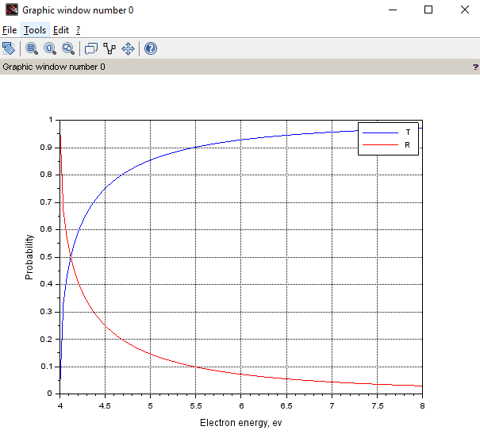

## Lab 2

**Task** : to calculate the transmission and reflection coefficients of the rectangular potential barrier of height U0.

**Theory** : we know (it's given in the task) that 

```
R = (k1 - k2)^2 / (k1 + k2)^2 ; 
T = (4 * k1 * k2) / (k1 + k2)^2 ;
```

where `k1 = sqrt(8 * m * %pi^2 * E / h^2)` and `k2 = sqrt(8 * m * %pi^2 * (E - U) / h^2)`. So, these two are the functions of argument *E*.

The required values like the mass, U0 height, pi number, Planck constant are known.

**Result** :

