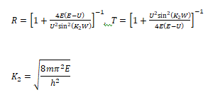
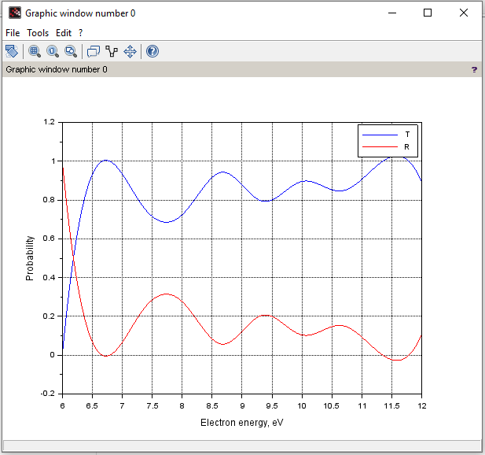

## Lab 3

**Task** : to calculate the transmission and reflection coefficients of the rectangular potential barrier of height U and width W.

**Theory** : we know (it's given in the task) that 

The required values like the mass, height U, width W, pi number, Planck constant are known.

In solution code we used *spline interpolation* for smooth graphs.

**Result** :

