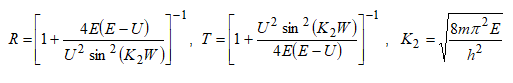
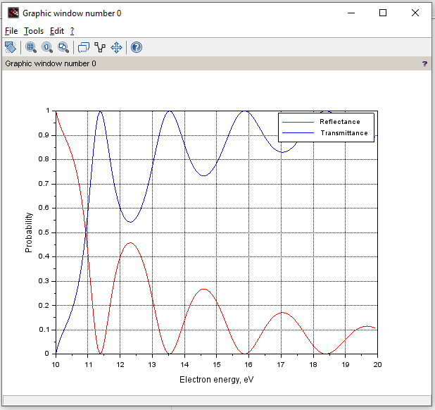

## Lab 4

**Task** : to calculate the reflectance and transmittance of electrons flow with a uniform energy distribution in a band [E0 - dE; E0 + dE].

**Theory** : we know (it's given in the task) that 

The required values like the mass, height U, width W, pi number, Planck constant are known.

**Result** :

