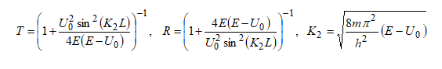
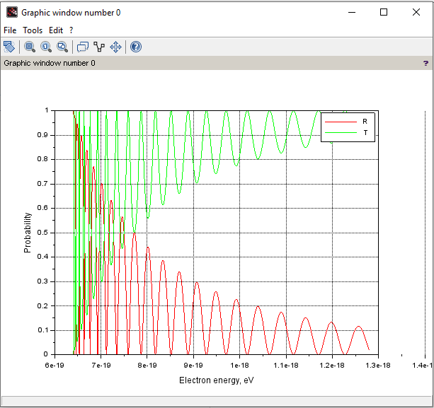

## Lab 5

**Task** : to calculate the reflectance and transmittance of the symmetric potential barrier of height U and width L.

**Theory** : we know (it's given in the task) that 

The required values like the mass, height U, width L, pi number, Planck constant are known.

**Result** :

