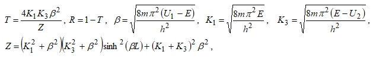
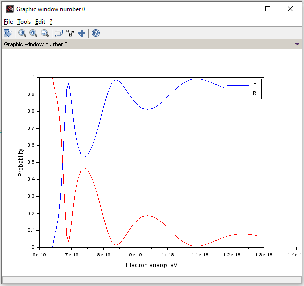

## Lab 6

**Task** : to calculate the reflectance and transmittance of the asymmetric potential barrier with height U1 on the left and U1-U2 on the right, width L.

**Theory** : we know (it's given in the task) that 

The required values like the mass, heights U1 and U2, width L, pi number, Planck constant are known.

**Result** :

